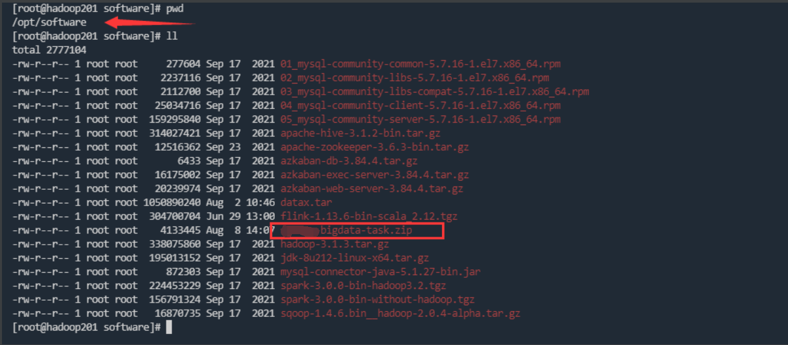

# bigdata-ansible
使用ansible自动化部署大数据组件及数据平台应用

注意：所有软件都将安装在 /data 目录下，请提前规划好磁盘存储
# 目录说明
## /etc/ansible 
ansible.cfg 为ansible主控机配置文件

hosts 为要管理的主机地址分组，此处也作为大数据集群的角色分组

## /opt/software
存放要进行安装的软件包，需要上传到ansible主控机的/opt/software目录

软件下载地址
链接：https://pan.baidu.com/s/1lPrJVnNl0ampLUdIBFCbsQ


## /data/ansible
存放自动化部署的过程脚本，执行示例
````
ansible-playbook  /data/ansible/role_jdk.yml
````

# 安装步骤

## 1、安装ansible

在主控机执行命令
````
yum install ansible
````
修改ansible配置
````
vi /etc/ansible/ansible.cfg
````
````
#只列出需要改动的配置 其他使用默认，不再一一列举
# uncomment this to disable SSH key host checking
host_key_checking = False

# default module name for /usr/bin/ansible
module_name = shell
````

## 2、配置免密登录

### 修改各主机host
````
hostnamectl set-hostname hadoop301
# 编辑要进行通信的主机名
vi /etc/hosts
192.168.30.128  hadoop301
192.168.30.129  hadoop302
192.168.30.130  hadoop303
````

### ssh免密登录

在各个机器上分别执行
````
ssh-keygen -t rsa
````
将秘钥拷贝到其他主机，按提示输入密码等
````
ssh-copy-id hadoop301
ssh-copy-id hadoop302
ssh-copy-id hadoop303
````

## 3、配置ansible要管理的主机，分配集群角色
````
vi /etc/ansible/hosts
````
````
#示例
#ansible主控机host 用于执行一些远程命令 须是hadoop一个节点
[master]
hadoop301

[zk]
#zk_myid 为zk的节点编号，从1开始，按顺序排列
hadoop301 zk_myid=1
hadoop302 zk_myid=2
hadoop303 zk_myid=3

[hadoop]
hadoop301
hadoop302
hadoop303

[namenode]
hadoop301
hadoop302

[resource_manager]
hadoop301
hadoop302

[yarn_log_server]
hadoop301

[journlnode]
hadoop301
hadoop302
hadoop303

[spark_master]
hadoop301
hadoop302

[spark_worker]
hadoop301
hadoop302
hadoop303

[mysql]
hadoop303 

[azkaban_server]
hadoop303

[azkaban_exec]
hadoop301
hadoop302

[sqoop]
hadoop301
hadoop302
hadoop303

[hive]
hadoop301
hadoop302
hadoop303

[hive_server2]
hadoop301
hadoop302

````
验证host是否通
````
ansible all -m ping
````

## 4、上传包到主控机，并修改配置
###4.1 安装包
目录 /opt/software

### 4.2、上传安装脚本到主控机
目录 /data/ansible

**注意** 安装脚本的相对路径不要变
### 4.3、修改配置文件
修改bigdata-task.zip 中的task_executor/config目录下的配置文件

修改下列几个文件的数据库配置信息

- role_mysql.yml
- role_spark.yml
- role_hive.yml
- role_azkaban.yml
## 5、一键安装
````
sh  /data/ansible/main.sh
````
**注意** 本脚本执行场景为未安装启动任何服务，且执行安装为高危操作，会将数据目录先删除
## 各角色分别安装
以jdk为例进行说明 

1、检查脚本是否正常
````
ansible-playbook -C /data/ansible/role_jdk.yml
````
2、执行安装脚本
````
ansible-playbook  /data/ansible/role_jdk.yml
````


# 待优化

bigdata-task.zip 中接口和数据库地址需要修改

安装路径等很多都是写死，后期可以优化变量的配置

# 参考资料
## jinja2 模板语言 template使用该语言编写
http://docs.jinkan.org/docs/jinja2/
